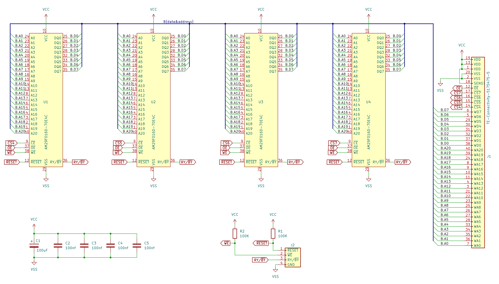
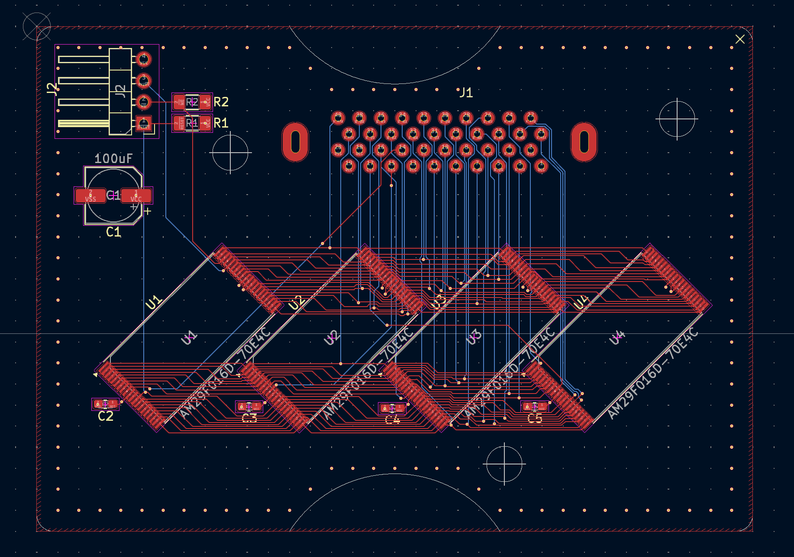
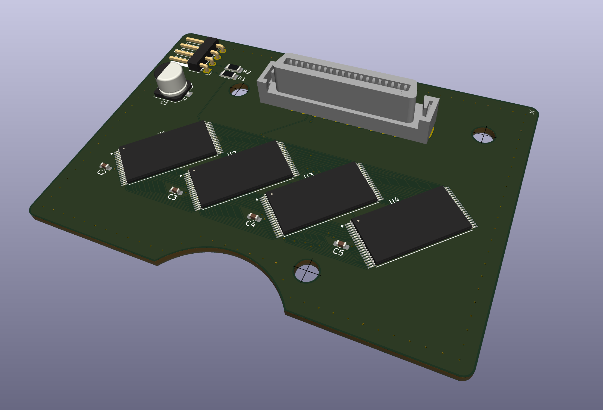
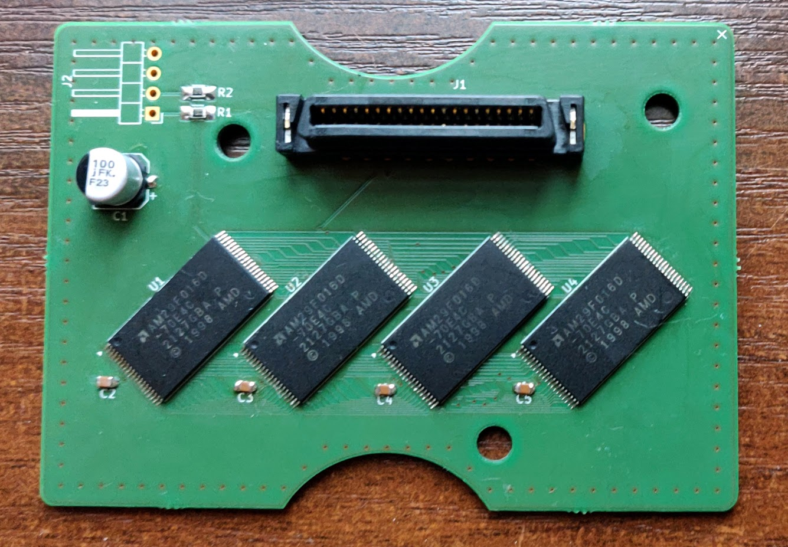
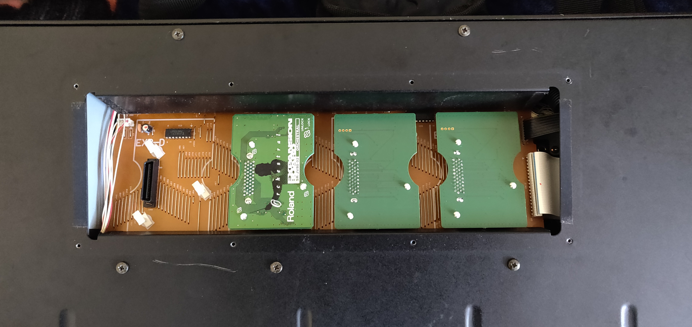

# DIY Roland JV-1080 expansion card

Recently I restored a [Roland XP-60][1] synth for a friend. It's a digital sample
based synth with possibility of expanding sample set with up to 4 expansion
cards. And, while looking at service manual I got carried away a little...
Those expansion cards have a pretty straightforward interface - 8 bit data bus,
20 bit address bus, a few chip enable pins. Looked like something very DIYable.

Needless to say, I'm not the first one to notice it. Someone made copies of available
expansions and reverse engineered the format. [SRJV][3] is a script collection
to create/manipulate those ROMs.

# Schematic

For my own clone I used AM29F016D-70E4C flash chips. These are obsolete but still
widely available on eBay.

I included extra headers to expose flash WE, RESET for in-circuit programming,
but that part is untested - I ended up pre-programming chips before soldering.

# PCB

Did not want to spend too much time on layout so went with a more expensive
4 layer board.

# Assembled board

Two expansions installed next to one original from Roland:

[1]: https://www.vintagesynth.com/roland/xp-60
[2]: https://en.wikipedia.org/wiki/Roland_JV-1080
[3]: https://github.com/PythonBlue/SRJV
